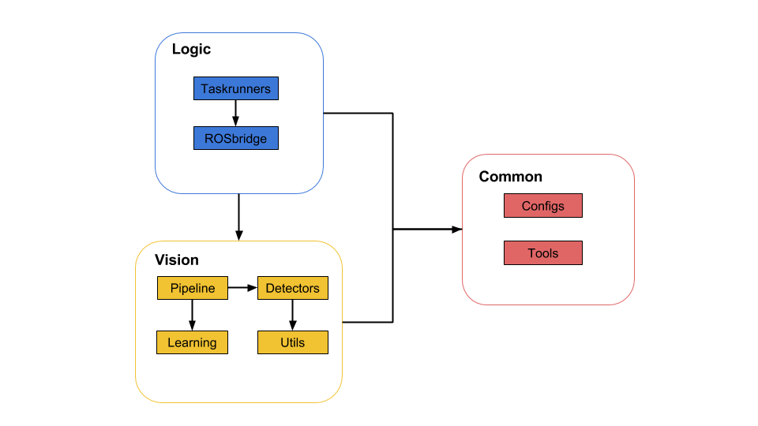

# Developer Guide

## Table of Contents
- [`System Architecture`](#system-architecture)
- [`Logic`](#logic)
  - [`Taskrunners`](#taskrunners)
  - [`ROSbridge`](#rosbridge)
- [`Vision`](#vision)
  - [`Detectors`](#detectors)
  - [`Utils`](#utils)
  - [`Learning`](#learning)
  - [`Pipelines`](#pipelines)
- [`Common`](#common)
  - [`Configs`](#configs)
  - [`Tools`](#tools)

## 1. System Architecture

- `Logic component` consists of modules that deal with execution of vision task via communication with other ROS modules.
- `Vision component` has modules that perform image processing and machine learning tasks
- `Common component` stores configuration files and helper tools 

## 2. Logic

### Taskrunners
- Make use of smach Concurrence container
- Save outcomes, transition and outcome_test in config 
- Using userdata to pass around states 
- Every taskrunner will inherit from a base taskrunner that has Disengage state

### ROSbridge
- `Comm.py` handles any intercommunication between vehicle and taskrunner
  - register subscribers, publishers and locomotion server 
  - init PID 
  - run server and service proxy for communication with mission planner 
  - `arguments` -> static (no movement), alone (without waiting for mission planner)
  - `states` -> activated (by mission planner), preempted, completed

## 3. Vision

### Detectors
- `SingleObjectDetector.py` takes as input an OpenCV color image and returns `Output`
  - declare tunable params in config
  - realtime callback when reconfigure
  
### Utils

### Learning

### Pipelines

## 4. Common

### Configs
- `BaseConfig.py` needed to be implemented by each taskrunner.
  - `name` -> task name which is used in topic 
  - `detector` -> object detector used by the task 
  - `subscriber_list` -> list of subscribers needed 
  - `publisher_list` -> vision result and debugging image topis from `detector`
  - `constants` -> ROS topics used on vehicle 
- `ParamConfig.py` stores vision_function and arguments pair to enable tuning of vision parameters 

### Tools
